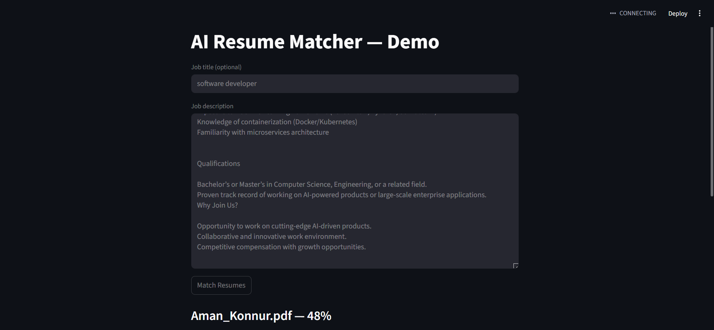
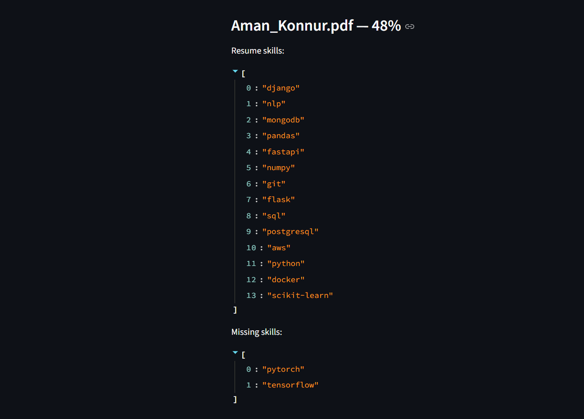

# 🧠 AI-Powered Resume Matcher using NLP & FastAPI

An intelligent resume analysis and matching system that uses **Natural Language Processing (NLP)** and **Transformer embeddings (BERT)** to match candidate resumes with job descriptions.  

It extracts, analyzes, and computes the **semantic similarity** between resumes and job descriptions, providing a match score, skill gap, and relevant keywords.

---

## 🚀 Features

- 📂 **PDF Resume Upload** using FastAPI
- 🔍 **Resume Text Extraction** via `pdfplumber`
- 🧩 **Section Parsing** (Skills, Experience, Education)
- 🧠 **Semantic Embeddings** with Hugging Face `SentenceTransformers (BERT)`
- ⚡ **Similarity Search** using `FAISS`
- 💾 **Data Storage** in MongoDB
- 🧰 **Async FastAPI Endpoints** for optimized processing
- 💡 **(Upcoming)** Interactive Streamlit frontend dashboard

---

## 🏗️ Tech Stack

| Category | Technologies Used |
|-----------|-------------------|
| **Backend Framework** | FastAPI |
| **Language** | Python |
| **PDF Parsing** | pdfplumber |
| **NLP / Embeddings** | Hugging Face Transformers, SentenceTransformers, SpaCy, NLTK |
| **Similarity Engine** | FAISS |
| **Database** | MongoDB |
| **Frontend (upcoming)** | Streamlit |
| **Environment** | Virtualenv |
| **Async Handling** | asyncio, httpx |

---

## ⚙️ Installation & Setup & Run

1. **Clone the Repository**
   ```bash
   git clone https://github.com/<your-username>/ai-resume-matcher.git
   cd ai-resume-matcher

2. **Run commands**
   ```bash
   uvicorn main:app --reload & streamlit run app.py

## 📸 Project Screenshots

### Interface Preview


### Match Result View


